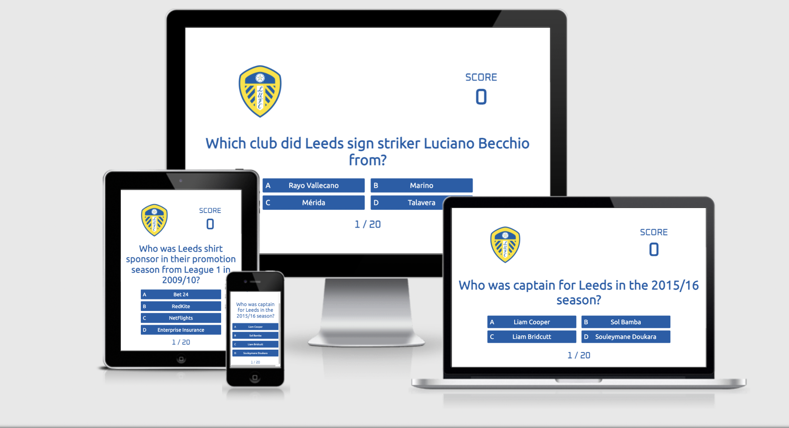

# Leeds United Quiz

This is a quiz on Leeds United FC, which is aimed at Leeds fans and will allow them to test their knowledge on the club. Due to the nature of the questions it is more likely to be suited to young adults or older.

Live Link: https://vfg-95.github.io/leeds-quiz/

## Table of Contents

1. [Goals](#goals)
    1. [Organisation Aims](#organisation-aims)
    2. [User Stories](#user-stories)
2. [Design](#design)
    1. [Colour Scheme](#colour-scheme)
    2. [Fonts](#fonts)
    3. [Wireframe](#wireframe)
3. [Features](#features)
    1. [Homepage](#homepage)
    2. [Q&A Section](#q&a-section)
    3. [Answer Feedback](#answer-feedback)
    4. [Score](#score)
    5. [Quiz Progress](#quiz-progress)
    6. [Score Page](#score-page)
    7. [Features To Implement](#features-to-implement)

## Goals

### Organisation Aims
- Make the sites purpose obvious on landing
- Create a fun but challenging quiz for the target audience
- Use an appropriate, visually pleasing colour scheme
- Make the quiz/site easy to navigate and complete

### User Stories
- I want to be able to quickly and intuitively complete the quiz
- I want to know what question I am on during the quiz
- I want to know my final score from the quiz
- I want to be able to retake the quiz
- I want to know what the correct answer is

## Design

I wanted the design to be simple and clean, which I achieved by keeping it very minimal and including the essential features which are discussed below. Other than the Leeds badge no other photos are included as I felt if I were to use one that it would be best used as a background image which I thought would be distracting from the quiz itself.

### Colour Scheme

The colour scheme was very easy to decide on as I matched it to kit/badge colours of Leeds United; White, Yellow and Blue.

### Fonts

I used two google fonts for the site, 'Ubuntu' was the default font used on the quiz name, play & home buttons, and the questions and answers themsleves. I then used 'Oxanium' for anything relating to the score, progress or answer feedback.

### Wireframe

I drew out the design for my wireframe. There were some changes/additions but the basic outline stayed the same for both the home page and quiz page. I came up with the final score page later in the project.

## Features

### Homepage
The home page clearly states what the site is for and allows the user to start the quiz with the 'play' button.

### Q&A Section
The main feature of the quiz is the Q&A section which provdes the user with the questions and 4 interactive options for the user to choose from and complete the quiz. Users will instinctively click/press on the options to choose their answer. 

### Answer Feedback
The feedback feature appears in the place of the quiz progress when a user choses an answer. This hides the quiz progress and tells the user whether their answer was correct, or if not what the correct answer was. It also uses colour to visually aid the user, yellow meaning correct and blue incorrect.

### Score
The score feature increments with every correct answer to let the user know how many questions they have answered correctly whilst doing the quiz.

### Quiz Progress
The quiz progress feature increments with each question and displays to the user what number question they are on and the total number of questions.

### Score Page
Once the user finishes they are taken to the score page which tells them their final score along with a custom quote which is chosen depending on their final score. The user can then go back to the homepage and restart the quiz is they wish.

### Features To Implement

I was going to include a scoreboard (you can see this is commented out in the index.html file) to allow users to save their name and score, however I realised that as the site only makes use of local storage users on other devices/browsers would not actually see one another scores and so this is something which can be done with future development.

